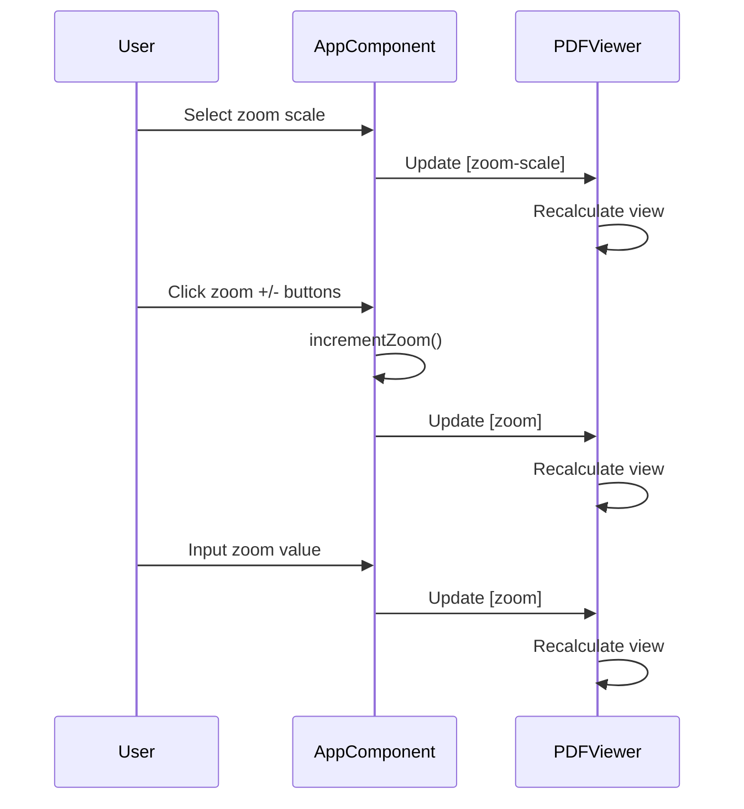

# PDF Viewer Zoom Control Analysis

## Entry Point

The zoom control functionality is primarily implemented in:

- `src/app/app.component.html` - UI controls for zoom
- `src/app/app.component.ts` - Zoom control logic

Key entry points:

- `incrementZoom(amount: number)` method in `AppComponent`
- Zoom scale selection via `mat-select` with `zoomScale` binding
- Direct zoom input via `mat-form-field` with `zoom` binding

## Strategy Design Overview

The zoom control system is a core feature of the PDF viewer that enables users to:

- Adjust the viewing scale of PDF documents
- Choose between different zoom strategies (page-width, page-height, page-fit)
- Fine-tune zoom levels with precise numeric input
- Maintain zoom state across page navigation

This feature is essential for document readability and accessibility, allowing users to optimize their viewing experience based on their needs and screen size.

## High-Level Flow Overview

The zoom control system operates through several interconnected mechanisms:

1. **Zoom Scale Selection**

   - Users can select from predefined zoom scales:
     - `page-width`: Fits to page width
     - `page-height`: Fits to page height
     - `page-fit`: Fits entire page in view
   - These options are only available when `originalSize` is false

2. **Manual Zoom Control**

   - Incremental zoom adjustment via +/- buttons
   - Direct numeric input for precise zoom levels
   - Zoom state is maintained in the `zoom` property

3. **Integration with PDF Viewer**
   - Zoom settings are passed to the PDF viewer component
   - Changes trigger re-rendering of the PDF content
   - Zoom state persists across page navigation

## Special Notes & Comments

No specific TODO/FIXME comments were found related to zoom functionality.

## Entities

### AppComponent

**Location**: `src/app/app.component.ts`
**Purpose**: Main component managing zoom state and controls
**Key Properties**:

- `zoom: number` - Current zoom level
- `zoomScale: ZoomScale` - Selected zoom scale strategy
- `originalSize: boolean` - Toggle for original size viewing

### PDF Viewer Component

**Location**: `src/app/pdf-viewer/pdf-viewer.component.ts`
**Purpose**: Renders PDF content with applied zoom settings
**Key Properties**:

- `[zoom]` - Input property for zoom level
- `[zoom-scale]` - Input property for zoom scale strategy

## Call Flow Diagram

## Navigation & Diving In

### Key Files

- [src/app/app.component.html](../src/app/app.component.html) - Zoom control UI
- [src/app/app.component.ts](../src/app/app.component.ts) - Zoom control logic
- [src/app/pdf-viewer/pdf-viewer.component.ts](../src/app/pdf-viewer/pdf-viewer.component.ts) - PDF rendering with zoom

### Next Steps

- Review PDF viewer component implementation for zoom handling
- Investigate zoom persistence across page navigation
- Examine zoom calculation logic in PDF rendering
